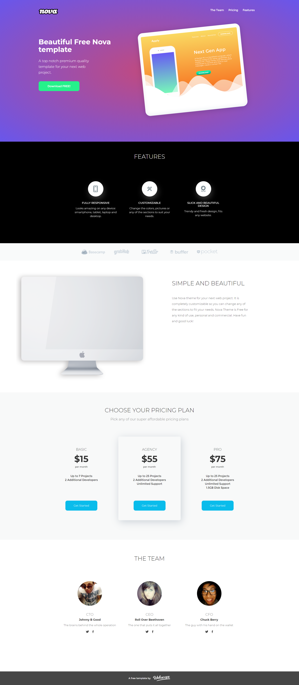

# Website design project ( version for desktop )

- [Overview](#overview)
  - [The challenge](#the-challenge)
  - [Screenshot](#screenshot)
  - [Links](#links)
- [My process](#my-process)
  - [Built with](#built-with)
  - [What I learned](#what-i-learned)
  - [Useful resources](#useful-resources)
- [Author](#author)
- [Special thanks](#special-thanks)

## Overview

### The challenge

The project consisted in mapping a website based on a designe from [Webscope](https://webscopeapp.com/).

### ScreenShot

### Links:

- Code: [See my code](https://github.com/KajetanKisielewski/Website-design-project-desktop-version-)
- Live: [Check it out](https://kajetankisielewski.github.io/Website-design-project-desktop-version-/)

## My process

### Built with

- Semantic HTML5 markup
- CSS custom properties
- BEM methodology
- Flexbox

### What I learned

Working with the project gave me the opportunity to get acquainted with the BEM methodology, and to practice semantic tags in HTML. Thanks to the project, I also saw the benefits of splitting the code into smaller modules.

### Useful resources

- [BEM documentation](http://getbem.com/introduction/)

## Author

- Github - [Kajetan Kisielewski](https://github.com/KajetanKisielewski)
- LinkedIn - [Kajetan Kisielewski](https://www.linkedin.com/in/kajetan-kisielewski-157b60208/)

## Special thanks

Thanks to my [Mentor - devmentor.pl](https://devmentor.pl/) - for providing me with this task and for code review.

